# Что такое интерполяция?

Интерполяция - это метод восстановления непрерывных поверхностей по набору дискретных измерений или получение промежуточных значений на основе известного набора данных.

Например, у вас есть измеренные значения высот в определенных точках, а вы хотите получить по ним цифровую модель рельефа с помощью интерполяции.

::: callout-note
Кроме интерполяции еще есть экстраполяция - получение прогнозных значений за пределами известных данных.
:::

------------------------------------------------------------------------

> В географии обычно имеют дело с двумерным случаем интерполяции — когда измерения проведены в некоторых географических локациях, и по ним нужно восстановить непрерывную картину поля распределения величины. В общем случае неизвестно, как ведет себя исследуемое явление между точками, поэтому существует бесчисленное множество вариантов интерполяции.[^1]

[^1]: *Самсонов Т.Е.* **Визуализация и анализ географических данных на языке R.** М.: Географический факультет МГУ, 2024. DOI: [10.5281/zenodo.901911](https://doi.org/10.5281/zenodo.901911)

А еще интерполяцию не нужно путать с аппроксимацией. Интерполяция позволяет получить функцию, которая точно проходит через точки с известными значениями, а аппроксимация дает только приближенные значения.

------------------------------------------------------------------------

::::: columns
::: {.column width="50%"}
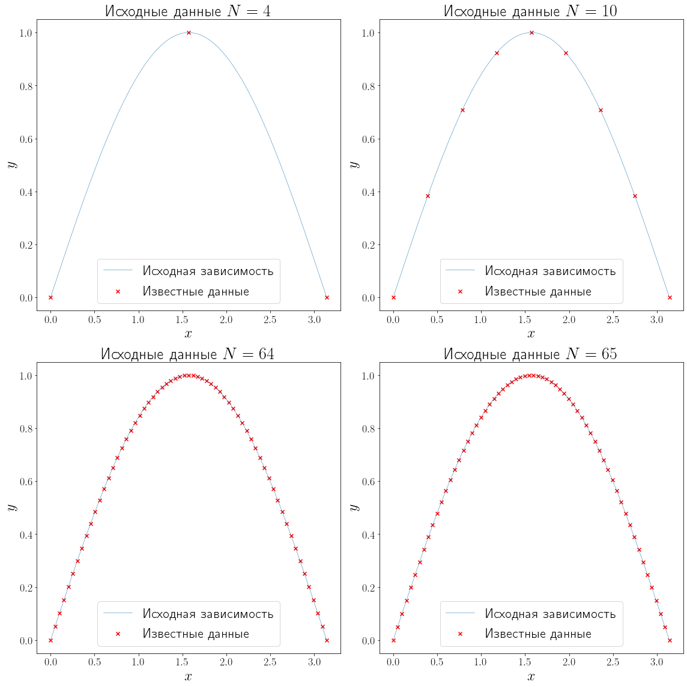{fig-align="center" width="800"}
:::

::: {.column width="50%"}
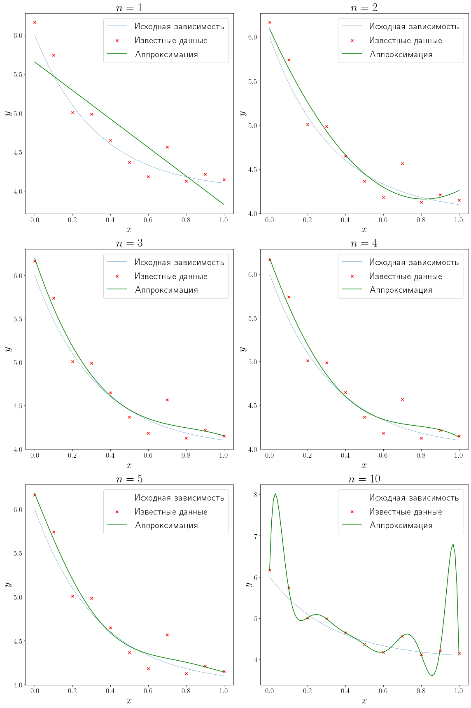{fig-align="center" width="532"}
:::
:::::

------------------------------------------------------------------------

Все методы интерполяции могут быть разделены на две группы:

-   **детерминистские/детерминистические** - это методы интерполяции, основанные на заданных зависимостях и близости наблюдений;

-   **геостатистические** - методы, учитывающие пространственную автокорреляцию и позволяющие построить поверхность на основе статистической зависимости.

::: callout-note
Методы первой группы значительно проще в использовании и интерпретации результатов, но не учитывают поведение величины между точками, которое определяется автокорреляцией.

Методы второй группы сложнее, но могут давать более точные результаты.
:::

## Метод ближайшего соседа

::: callout-note
Все методы интерполяции в той или иной степени основаны на идее, что значение интерполянта в точке должно в большей степени зависеть от значений данных в близлежащих точках, чем в удаленных. В интерполяции по принципу «естественного соседа» идея «соседства» в пространственной конфигурации формализуется естественным образом и становится количественной, а свойства метода зависят от, по-видимому, новой геометрической тождественности, связывающей эту количественную меру «соседства» с положением[^2].
:::

[^2]: Sibson, R. (1981), A Brief Description of Natural Neighbor Interpolation. In *Interpolating multivariate data*, John Wiley & Sons, New York, 1981, pp. 21-36.

В основу метода ближайшего соседа положены полигоны Вороного, полигоны Тиссена или тесселяция Дирихле.

------------------------------------------------------------------------

### Полигоны Вороного

Разбиение плоскости с точками на [выпуклые многоугольники](https://mathworld.wolfram.com/ConvexPolygon.html) таким образом, что каждый [многоугольник](https://mathworld.wolfram.com/Polygon.html) содержит [ровно одну](https://mathworld.wolfram.com/ExactlyOne.html) образующую точку, и каждая точка в данном многоугольнике находится ближе к своей образующей точке, чем к любой другой[^3].

[^3]: <https://mathworld.wolfram.com/VoronoiDiagram.html>

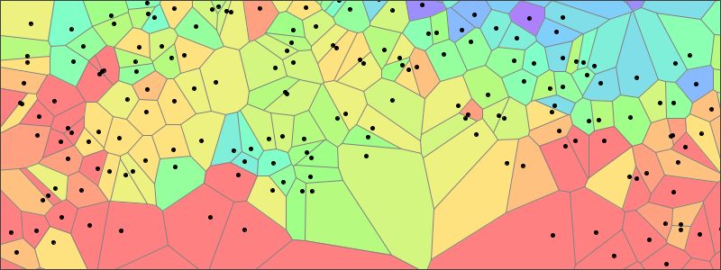{fig-align="center" width="1333"}

------------------------------------------------------------------------

::: callout-tip
## Простое объяснение

Пусть есть карта города, на которой точками обозначены почтовые отделения. Человек хочет отправить письмо, и он пойдёт на ближайшую почту. Ему интересно знать, какое отделение ближе, для любой точки города — необходимость отправить письмо может наступить неожиданно. Для этого он может взять карту и расчертить её на ячейки так, чтобы внутри каждой ячейки находилось только одно отделение, а для всех остальных точек ячейки именно эта почта была ближайшей. Полученная картинка и будет диаграммой Вороного для точек-почт[^4].
:::

[^4]: Диаграмма Вороного <https://neerc.ifmo.ru/wiki/index.php?title=%D0%94%D0%B8%D0%B0%D0%B3%D1%80%D0%B0%D0%BC%D0%BC%D0%B0_%D0%92%D0%BE%D1%80%D0%BE%D0%BD%D0%BE%D0%B3%D0%BE>

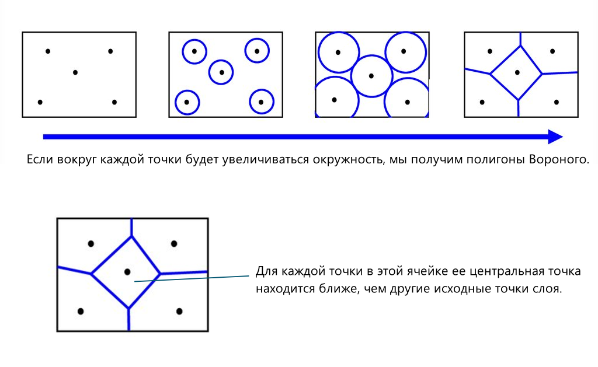{fig-align="center" width="814"}

------------------------------------------------------------------------

При интерполяции принимается, что внутри каждого полигона значение постоянно.

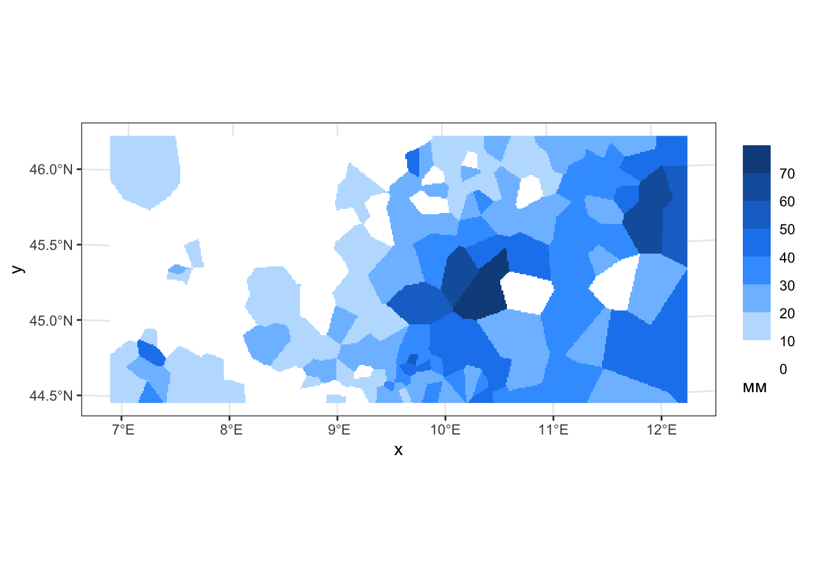{fig-align="center"}

------------------------------------------------------------------------

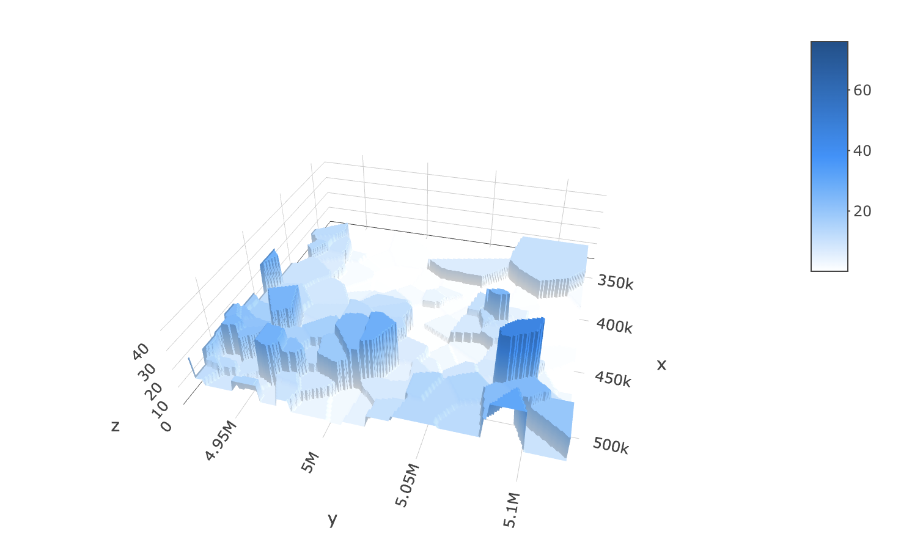{fig-align="center" width="1487"}

## Интерполяция на базе триангуляции

В этом случае на первом этапе строится триангуляционная сеть (как правило, на основе триангуляции Делоне), после чего для каждого из полученных треугольников выстраивается плоскость. Из полученного набора плоскостей формируется общая поверхность.

::: callout-note
**Подразбиение Делоне множества точек** — такое разбиение выпуклой оболочки множества точек на множество выпуклых фигур, что в окружности, описанной вокруг любой из фигур, не находится никаких точек из множества.

**Триангуляция Делоне множества точек** — триангуляция, являющаяся подразбиением Делоне.
:::

------------------------------------------------------------------------

::::: columns
::: {.column width="50%"}
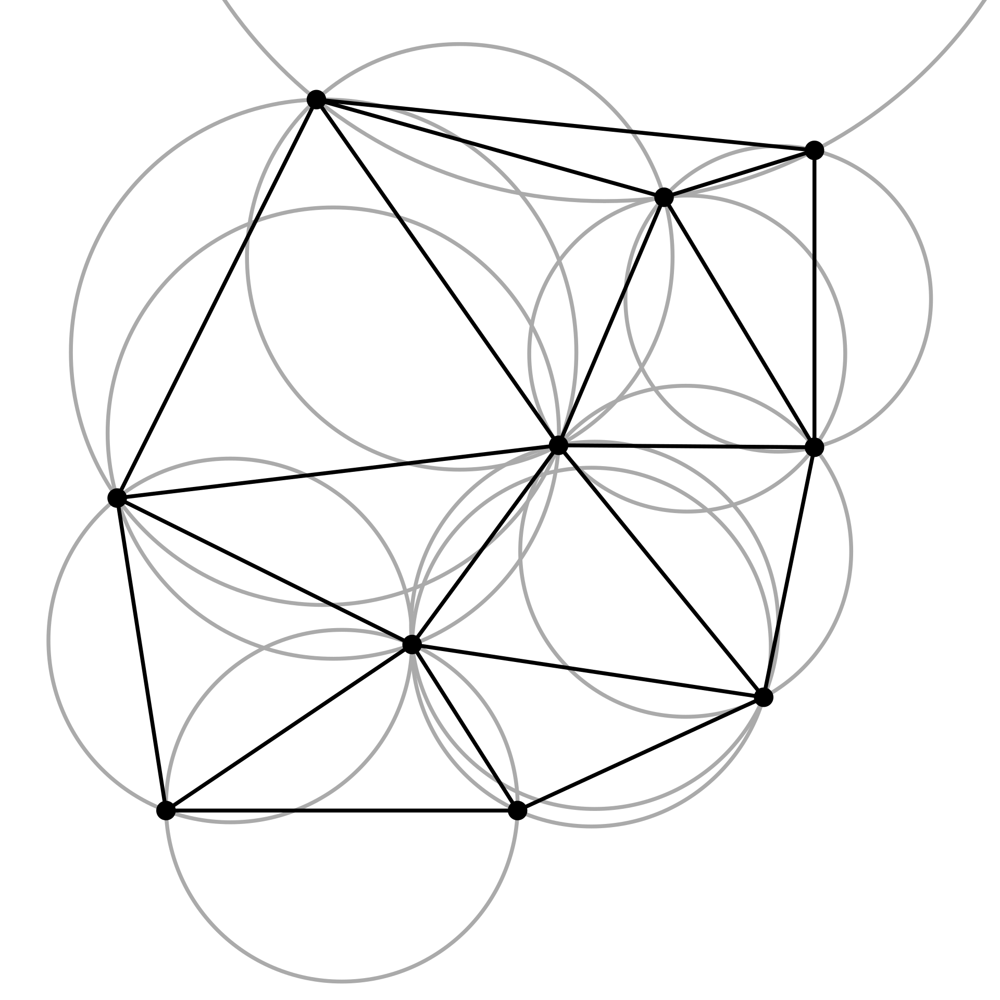{fig-align="center" width="900"}
:::

::: {.column width="50%"}
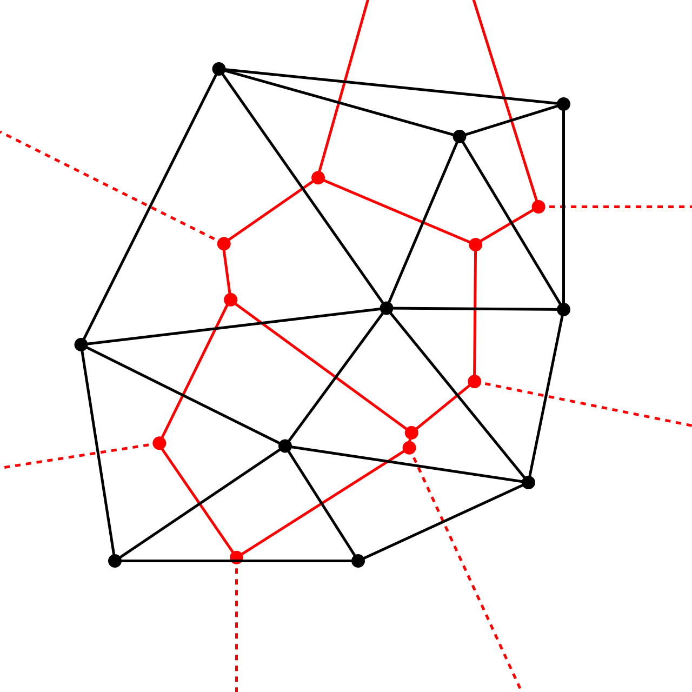{fig-align="center" width="900"}
:::
:::::

------------------------------------------------------------------------

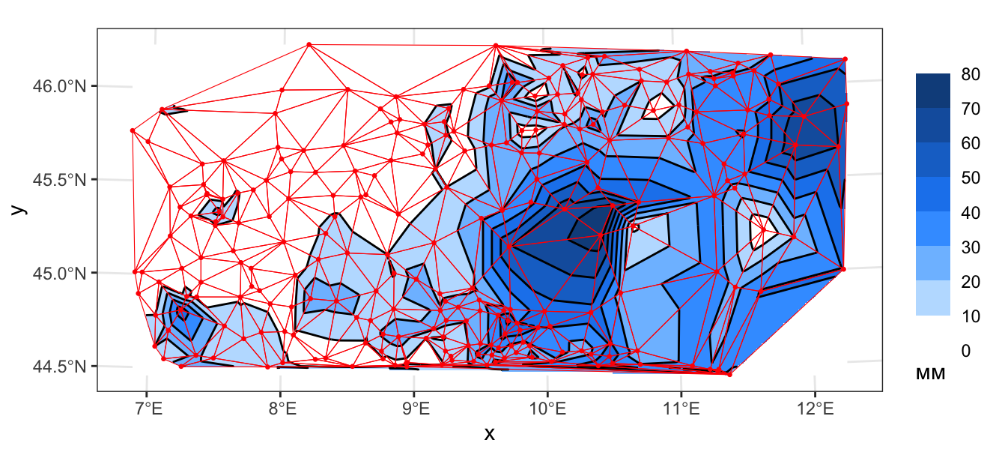{fig-align="center" width="1120"}

::: callout-important
В том случае, если вы работаете с данными рельефа, то рекомендуется использовать методы на основе триангуляции. Так как при использовании таких методов интерполяция происходит в пределах тех значений, которые известны.

Так вы получите *триангуляционную модель рельефа* - описание рельефа в виде набора высотных отметок ли отметок глубин в узлах треугольников - элементов триангуляции Делоне и ее обобщений[^5].
:::

[^5]: ГОСТ Р 52438-2005 Географические информационные системы. Термины и определения

------------------------------------------------------------------------

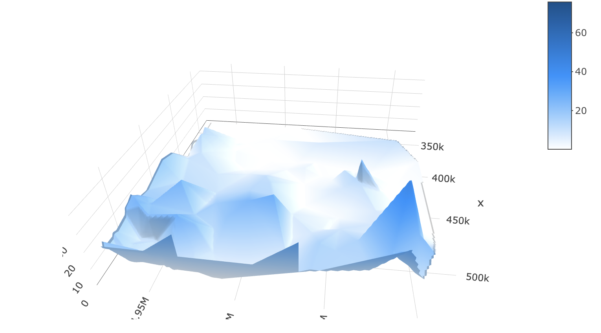{fig-align="center"}

## Метод обратно взвешенных расстояний (Inverse distance weights - IDW)

В этом методе значение показателя в произвольной точке будет равно средневзвешенной сумме значений в исходных точках.

$$
z(p)=\begin{cases}
\dfrac{\Sigma^N_{i=1}w_i(p)z_i}{\Sigma^N_{i=1}w_i(p)} & \quad \text{если $d(p,p_i) \neq0$ для всех $i$}\\ 
z_i & \quad \text{если $d(p,p_i) = 0$ хотя бы для одного $i$}
\end{cases}
$$

где $w_i(p)=|p-p_i|^{-p}$ - весовая функция.

Весовая функция может быть вычислена, например, по методу Шепарда:

$$
w_i(p)=d_i^{-2}/\sum_{j=1}^{n}d_i^{-2}
$$

------------------------------------------------------------------------

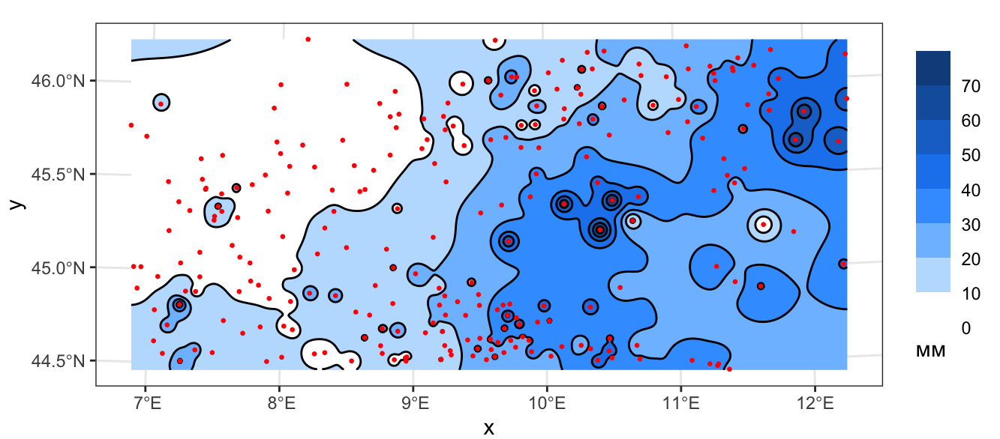{fig-align="center" width="910"}

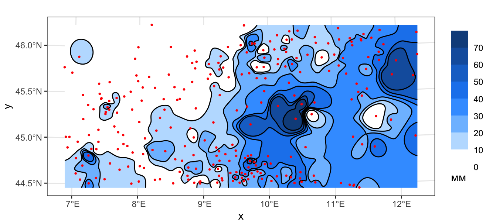{fig-align="center" width="879"}

------------------------------------------------------------------------

::: callout-warning
Большим недостатком метода является то, что он может давать ложные экстремумы и порождать значения, находящиеся за пределами измеренных.
:::

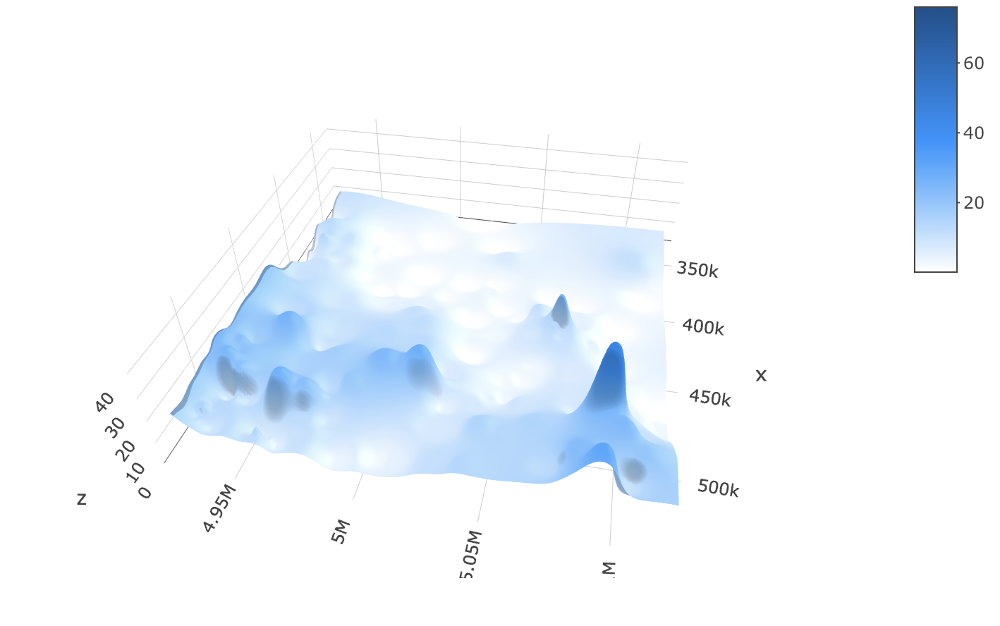{fig-align="center" width="1277"}

------------------------------------------------------------------------

::: callout-important
Основным параметром при использовании метода обратных взвешенных расстояний является степень весовой функции: при небольших ее значениях вы получите более острые вершины, а при ее увеличении - поверхность будет становиться более платообразной.

После определенного порога значения степени весовой функции поверхность станет приближенной к ступенчатой поверхности, полученной при интерполяции методом ближайшего соседа.
:::

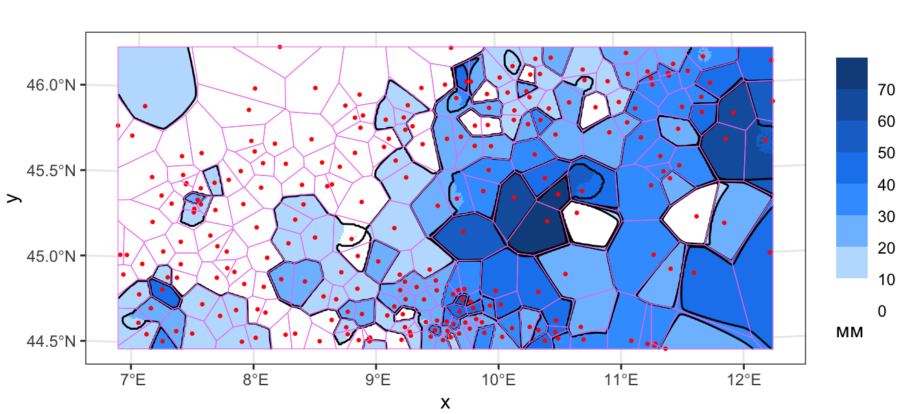{fig-align="center" width="980"}

------------------------------------------------------------------------

::::: columns
::: {.column width="50%"}
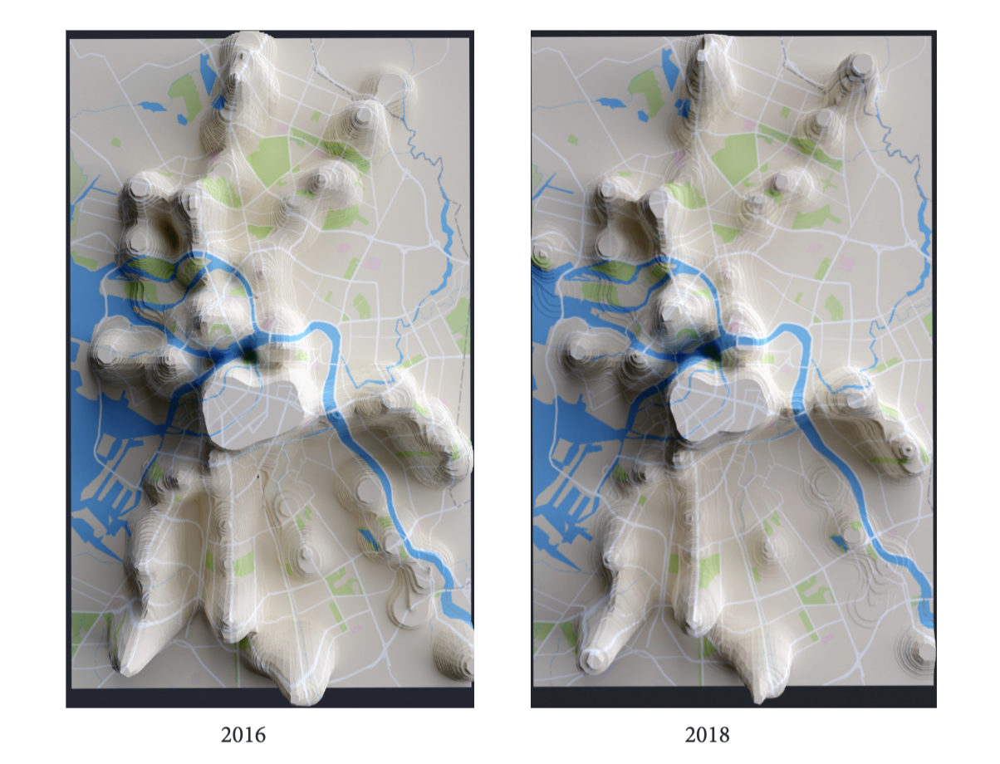
:::

::: {.column width="50%"}
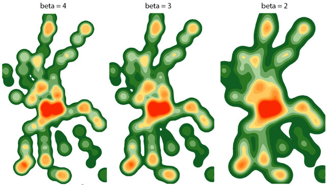{fig-align="center" width="879"}
:::
:::::

## Метод радиальных базисных функций (Radial Basis Functions - RBF)

При использовании радиальных базисных функций значение в произвольной точке $p$ рассчитывается на основе взвешенного среднего значения радиальной функции $\phi$.

$$
Z(p)=\sum^{n}_{i=1}\lambda_i\phi(||p-p_i||)
$$

Коэффициенты $\lambda_i$ находятся заранее на основе $n$ и условия $Z(p_i)=z_i$.

В этом методе могут использоваться различные функции, что делает его достаточно гибким.

------------------------------------------------------------------------

Однако, как и метод обратных взвешенных расстояний, метод радиальных базисных функций может давать значения за пределами измеренных величин.

::::: columns
::: {.column width="50%"}
![Пример профиля обратно взвешенных расстояний[^6]](images/clipboard-3171786514.png){fig-align="center" width="650"}
:::

::: {.column width="50%"}
{fig-align="center" width="621"}
:::
:::::

[^6]: Как работают радиальные базисные функции <https://pro.arcgis.com/ru/pro-app/3.4/help/analysis/geostatistical-analyst/how-radial-basis-functions-work.htm>

[^7]: Как работают радиальные базисные функции <https://pro.arcgis.com/ru/pro-app/3.4/help/analysis/geostatistical-analyst/how-radial-basis-functions-work.htm>

Этот недостаток может быть отчасти нивелирован при использовании сплайнов минимальной кривизны (*thin plate spline — TPS)*, которые позволят получить поверхность, проходящую через все точки с известным значением и минимальной кривизной между ними. Это позволит избежать резких изменений, которые характерны для метода обратных взвешенных расстояний.

------------------------------------------------------------------------

::::: columns
::: {.column width="50%"}
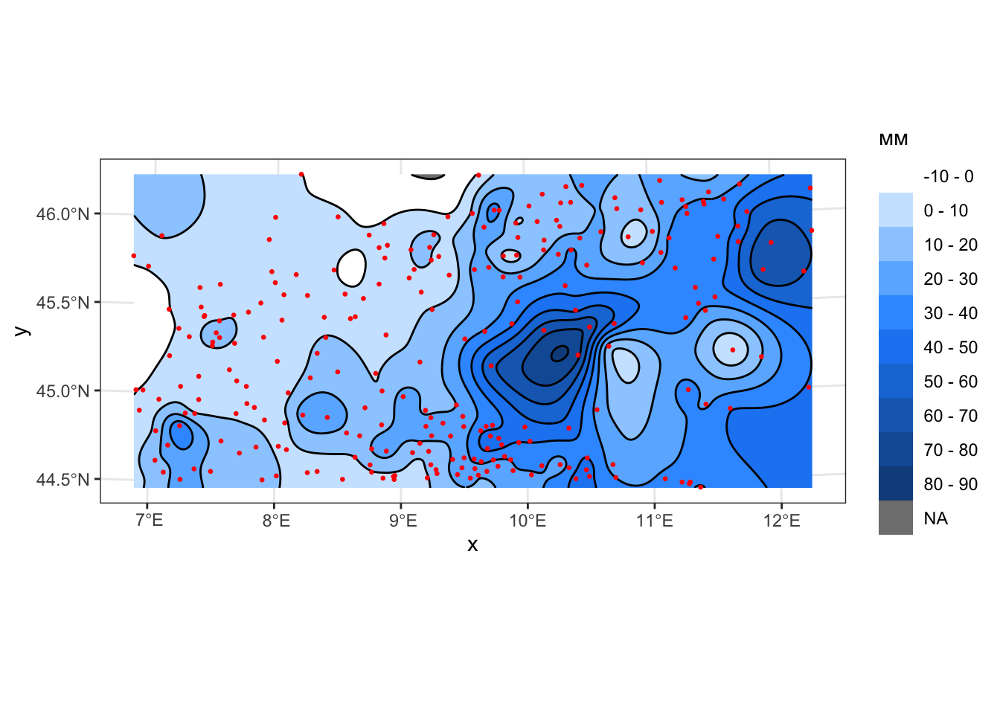{fig-align="center" width="1120"}
:::

::: {.column width="50%"}
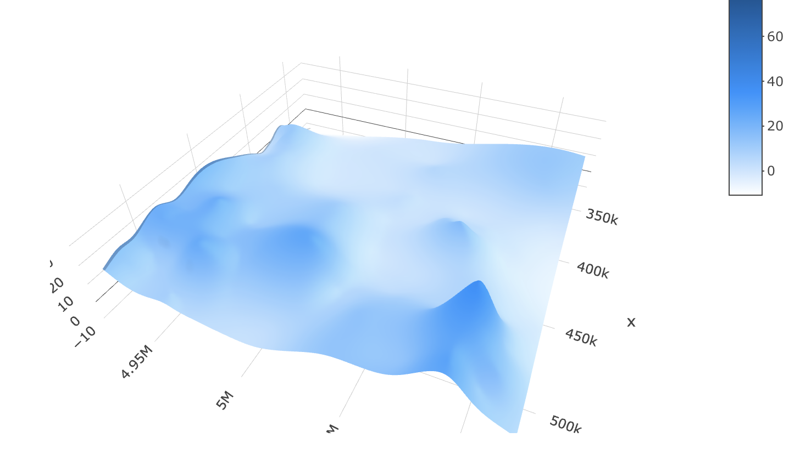{fig-align="center" width="1389"}
:::
:::::

## Кригинг

Кригинг является методом геостатистической интерполяции.

Метод назван по имени Дэниэла Криге - южноафриканского геолога, который занимался оценкой запасов месторождений.

::: callout-note
Геостатистические методы основаны на наличии пространственной автокорреляции, то есть связи наблюдаемых в различных местах значений.

Пространственная автокорреляция основана на том, что существует связь между значениями близко расположенных наблюдениями.
:::

Основная идея кригинга в связывании дисперсии наблюдаемых значений с расстоянием до определенных точек.

------------------------------------------------------------------------

Базируется такая оценка на полудисперсии: $$\gamma(h)=\dfrac{1}{2}E([z(x+h)-z(x)]^2)=\dfrac{1}{2N}\sum_{i=1}^{N}[z(x_i+h)-z(x_i)]^2$$ где $x$ - конкретная точка, $h$ - расстояние между точками или лаг, $x+h$ - другая точка на расстоянии $h$ от точки $x$, $z(x)$ и $z(x+h)$ - значения в этих точках, $E$ - среднее квадратов разностей (отсюда и преобразование формулы), $N$ - количество пар наблюдений, находящихся на расстоянии $h$, $x_i$ - $i$-ая позиция среди $N$ пар.

::: callout-important
Так как рассчитываемая величина равна половине математического ожидания квадратов разностей, поэтому она называется ***полудисперсией***.
:::

------------------------------------------------------------------------

В случае реальных наблюдений, как правило, практически нет пар, расположенных на конкретном расстоянии $h$ друг от друга, поэтому вместо конкретного расстояния используются диапазоны расстояний. То есть пары наблюдений, расстояние между которыми попало в определенный интервал будут считаться расположенными друг от друга на среднем для этого интервала расстоянии.

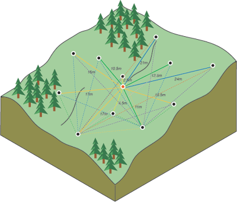{fig-align="center"}

------------------------------------------------------------------------

На первом этапе кригинга необходимо построить график эмпирической полудисперсии, на которой показывается зависимость полудисперсии от лага (расстояния) между значениями.

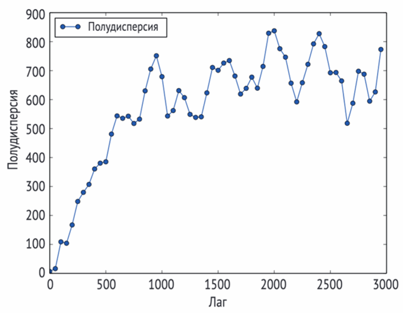{fig-align="center" width="644"}

------------------------------------------------------------------------

::: callout-caution
В некоторых источниках полудисперсия и полувариограмма используются как тождественные понятия, хотя полудисперсия - это числовое выражение вариации, а полувариограмма - график, показывающий полудисперсию.
:::

В качестве исходных данных для построения полувариограммы используются сведения о местоположении наблюдений и значения наблюдений. На основе местоположения наблюдений рассчитывается лаг между ними как матрица расстояний между всеми парами точек.

На основе расстояний и значений наблюдений рассчитываются квадраты разности, а далее среднее значение квадратов разности для определенных интервалов.

------------------------------------------------------------------------

В первую очередь имеют значение отдельные элементы графика, например, то, где вариограмма пересекается с осью Y, то есть значение полудисперсии при нулевом расстоянии. Это значение называется *самородком (nugget)*. Как правило, если существует значительная разница между наблюдениями, расположенными в одном месте, это может показывать наличие ошибки измерения.

Второй важный элемент полувариограммы - это *порог (sill)*, то есть то значение, при котором график выходит на плато, а расстояние, на котором этот порог достигается называется *размахом (range)*. Фактически размах показывает расстояние, при достижении которого значения наблюдений перестают быть связанными друг с другом.

------------------------------------------------------------------------

Сам факт наличия порога и размаха говорит о том, что расстояние оказывает влияние на дисперсию значений: чем больше расстояние, тем выше дисперсия, то есть тем сильнее несходство двух наблюдений.

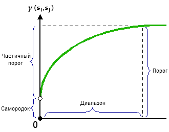{fig-align="center" width="512"}

------------------------------------------------------------------------

Кроме полудисперсии в качестве количественной метрики сходства наблюдений используется ковариация между парами: $$C(h)=E[(z(x)-\mu)(z(x+h)-\mu)]=\dfrac{1}{N}\sum_{i=1}^{N}z(x_i)z(x_i+h)-\mu^2$$ где $\mu$ - среднее наблюдаемое значение при лаге (расстоянии) $h$.

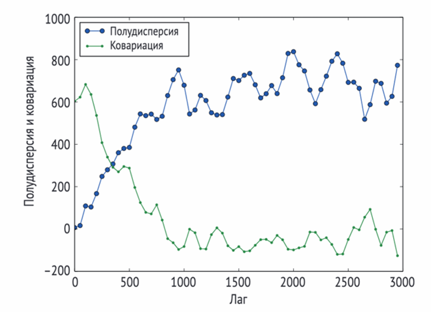{fig-align="center" width="691"}

------------------------------------------------------------------------

Тенденции изменения полувариограммы и ковариации противоположны друг другу. С учетом предположения, что среднее и дисперсия наблюдаемой величины постоянны в пространстве, то можно вывести взаимосвязь между величинами: $$C(0)=E[(z(x)-\mu)^2]= var[z(x)],\: \gamma(h)=C(0)-C(h)$$ где $var$ - дисперсия данных.

Далее задача интерполяции с использованием кригинга сводится к математической оптимизации функции.

------------------------------------------------------------------------

Наиболее широко распространенными моделями аппроксимации полувариограммы являются (во всех уравнениях $c_0, \ c, \ a$ - самородок, порог и размах соответственно):

-   *линейная модель*, выходящая на пороговый уровень по прямой с постоянным углом наклона $$\gamma(h)=\begin{cases} c_0+c\left(\dfrac{h}{a}\right) & \quad 0 \leq h \leq a \\ c_0+c & \quad h>a \\ 0 & \quad h=0\end{cases}$$

-   *сферическая модель*, в которой порог достигается на расстоянии размаха, при этом угол наклона при приближении к пороговому значению уменьшается $$\gamma(h)=\begin{cases} c_0+c\left[\dfrac{3h}{2a}-\dfrac{1}{2}\left(\dfrac{h}{a}\right)^3\right] & \quad 0 \leq h \leq a \\ c_0+c & \quad h>a \\ 0 & \quad h=0\end{cases}$$

------------------------------------------------------------------------

-   *экспоненциальная модель*, которая аналогична сферической модели с той лишь разницей, что на расстоянии размаха в ней достигается только 95% от порогового значения $$\gamma(h)=\begin{cases} c_0+c\left[1-e^\left(\dfrac{h}{a}\right)\right] & \quad h>0 \\ 0 & \quad h=0\end{cases}$$

-   *гауссова модель* не достигает порога на расстоянии размаха $$\gamma(h)=\begin{cases} c_0+c\left[1-e^\left(\dfrac{h^2}{a^2}\right)\right] & \quad h>0 \\ 0 & \quad h=0\end{cases}$$

------------------------------------------------------------------------

-   *степенная модель*, в которой параметр $\lambda$ в диапазоне от 0 до 2 может быть подобран под конкретные данные $$\gamma(h)=\begin{cases} c_0+c|h|^\lambda & \quad h>0 \\ 0 & \quad h=0\end{cases}$$

------------------------------------------------------------------------

Выделяют два основных вида кригинга:

-   *обыкновенный или обычный (ordinary)* кригинг, в котором среднее значени считается неизвестным и постоянным только в окрестностях точки оценивания;

-   *простой (simple)* кригинг, в котором среднее значение будет постоянным во всей области.

В общем случае кригинга результатом будет являться вычисленное значение в любой произвольной точке с учетом весовых коэффициентов для близких точек: $$\hat z(x_0)=\sum_{i}\lambda z(x_i)$$

С учетом предположения, что $\sum_{i}\lambda_i=1$.

От вида кригинга будет зависеть способ вычисления весовой матрицы.

## **Аппроксимационные методы**

При использовании аппроксимационных методов определяются тренды изменения в данных: глобальный и локальный (в окрестностях каждой точки).

В этом случае полученная поверхность не будет проходить через все точки.

Чаще всего в аппроксимационных методах используются поверхности разного порядка:

-   0 порядок - горизонтальная плоскость;

-   1 порядок - наклонная плоскость;

-   2 и 3 порядок - квадратичная и кубическая поверхность соответственно.

------------------------------------------------------------------------

### Глобальные тренды

:::::: columns
::: {.column width="30%"}
Поверхность 0 порядка

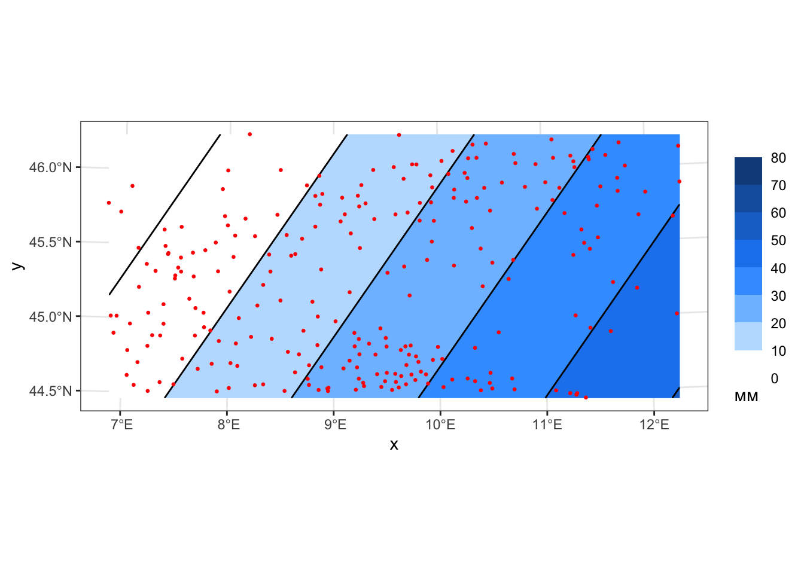{fig-align="center" width="600"}
:::

::: {.column width="30%"}
Поверхность 1 порядка

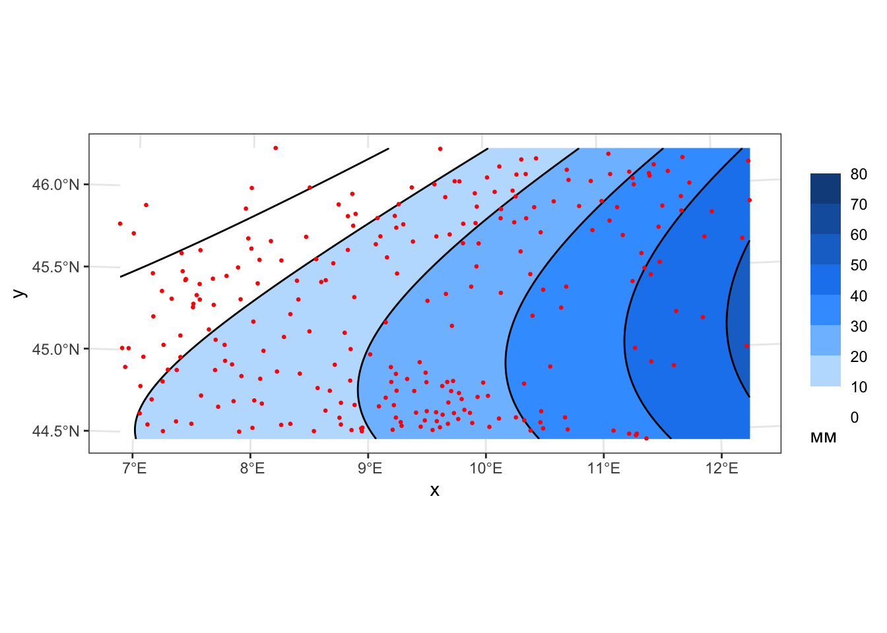{fig-align="center" width="600"}
:::

::: {.column width="30%"}
Поверхность 2 порядка

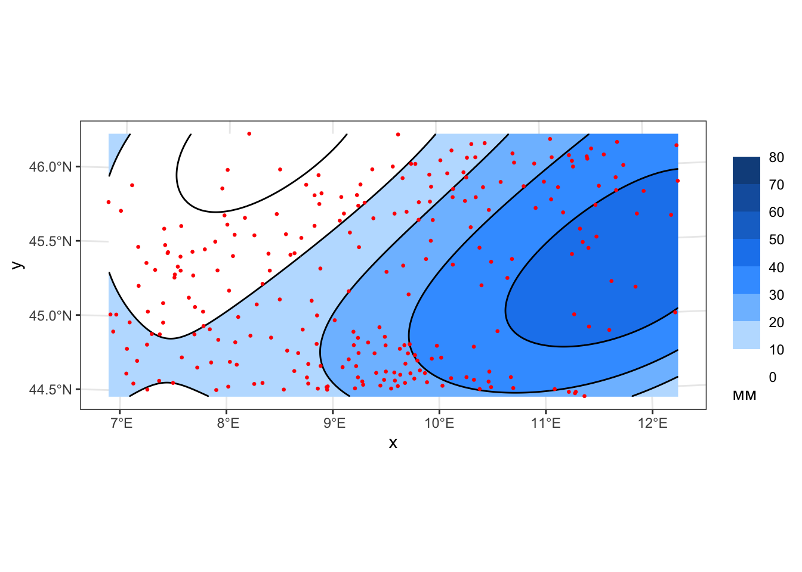{fig-align="center" width="600"}
:::
::::::

---

### Локальный тренд

При расчете локального тренда поверхность строится только в окрестностях ближайших исходных точек.

Построение локальных трендов основано на построении регрессионной модели в окрестностях этих точек и сглаживании результатов.

Аналогично глобульному тренду может использовать поверхности различных порядков.

---

#### Поверхность 0 порядка

::::: columns
::: {.column width="50%"}
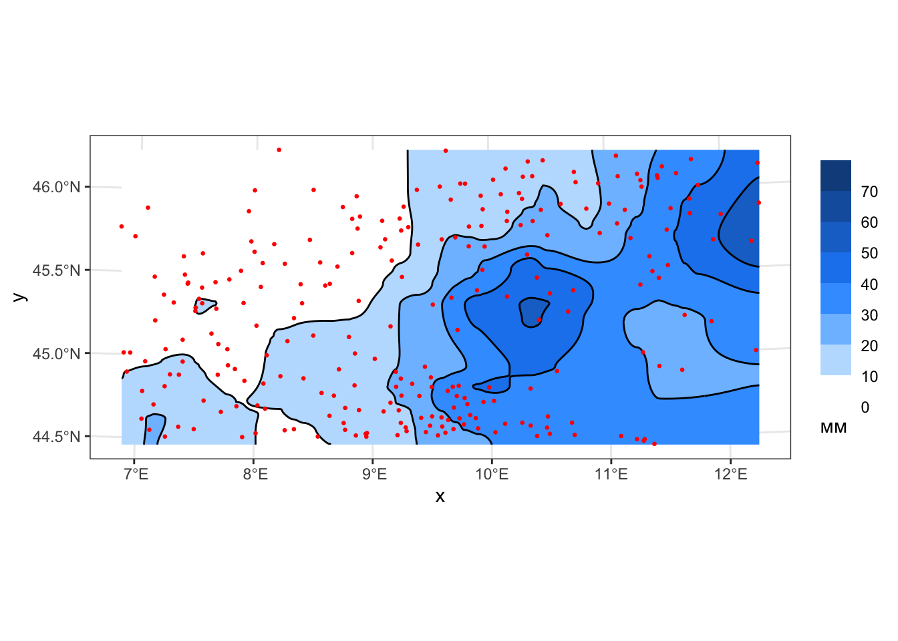{fig-align="center" width="800"}
:::

::: {.column width="50%"}

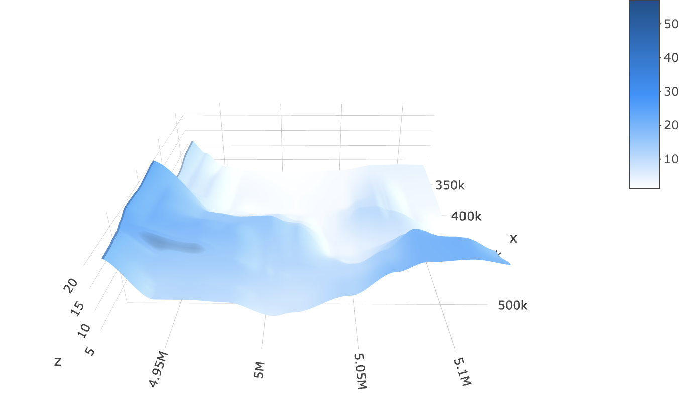{fig-align="center" width="700"}
:::
:::::

---

#### Поверхность 1 порядка

::::: columns
::: {.column width="50%"}
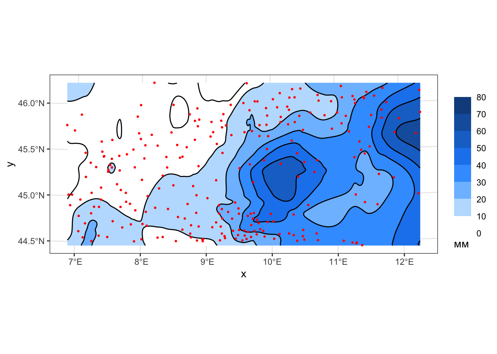{fig-align="center" width="800"}
:::

::: {.column width="50%"}

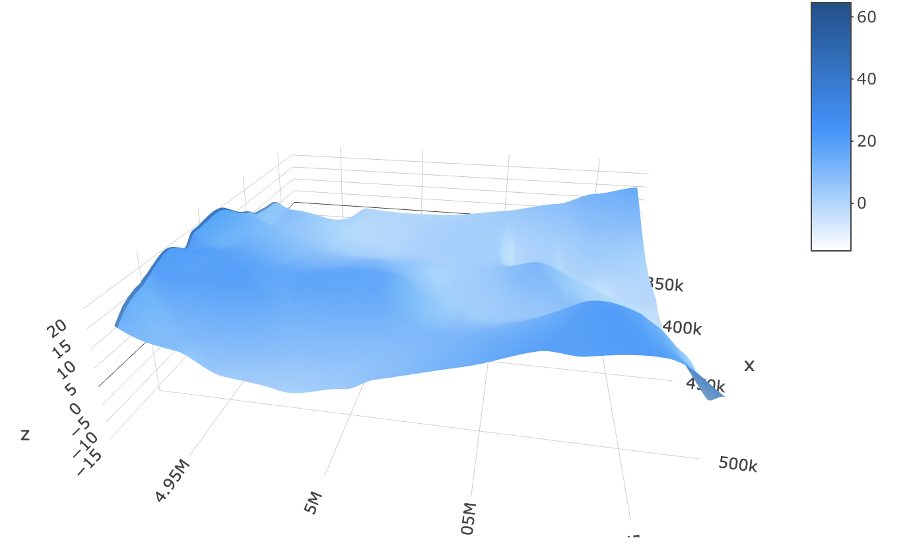{fig-align="center" width="700"}
:::
:::::

---

#### Поверхность 2 порядка

::::: columns
::: {.column width="50%"}
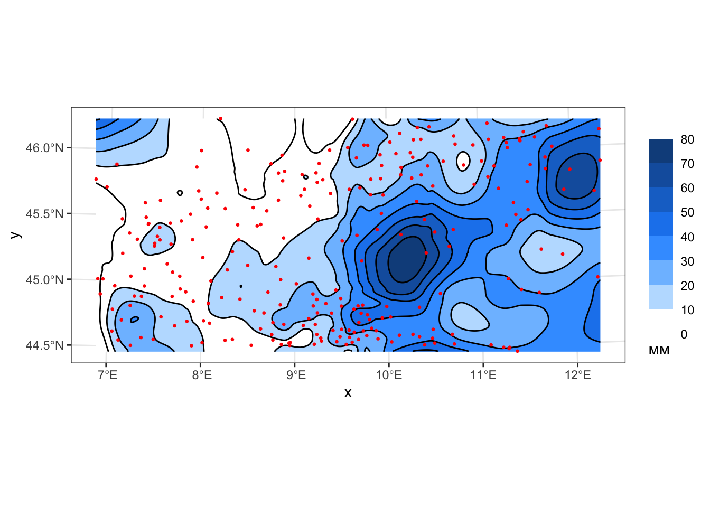{fig-align="center" width="800"}
:::

::: {.column width="50%"}

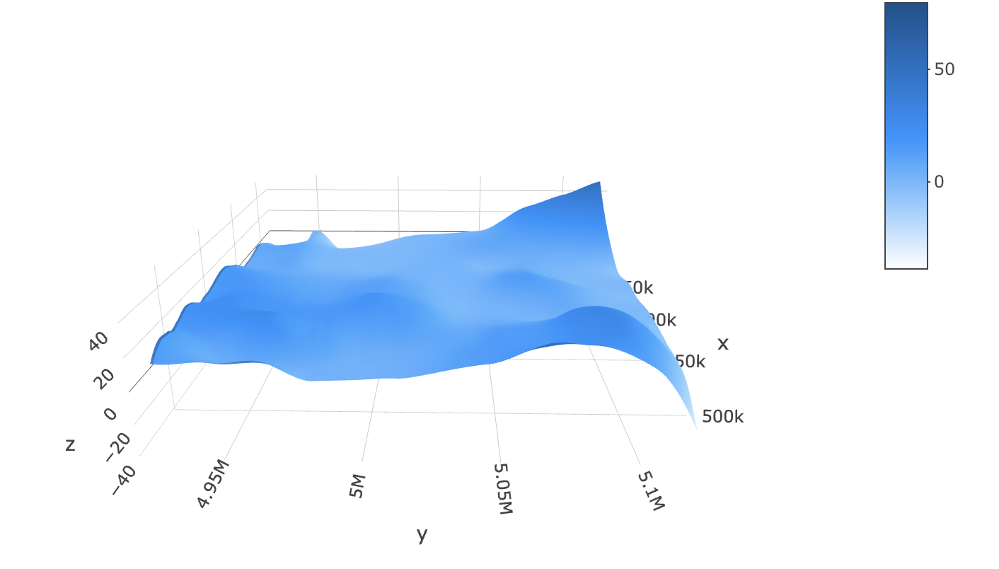{fig-align="center" width="700"}
:::
:::::
